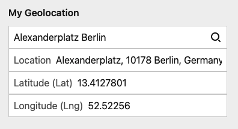
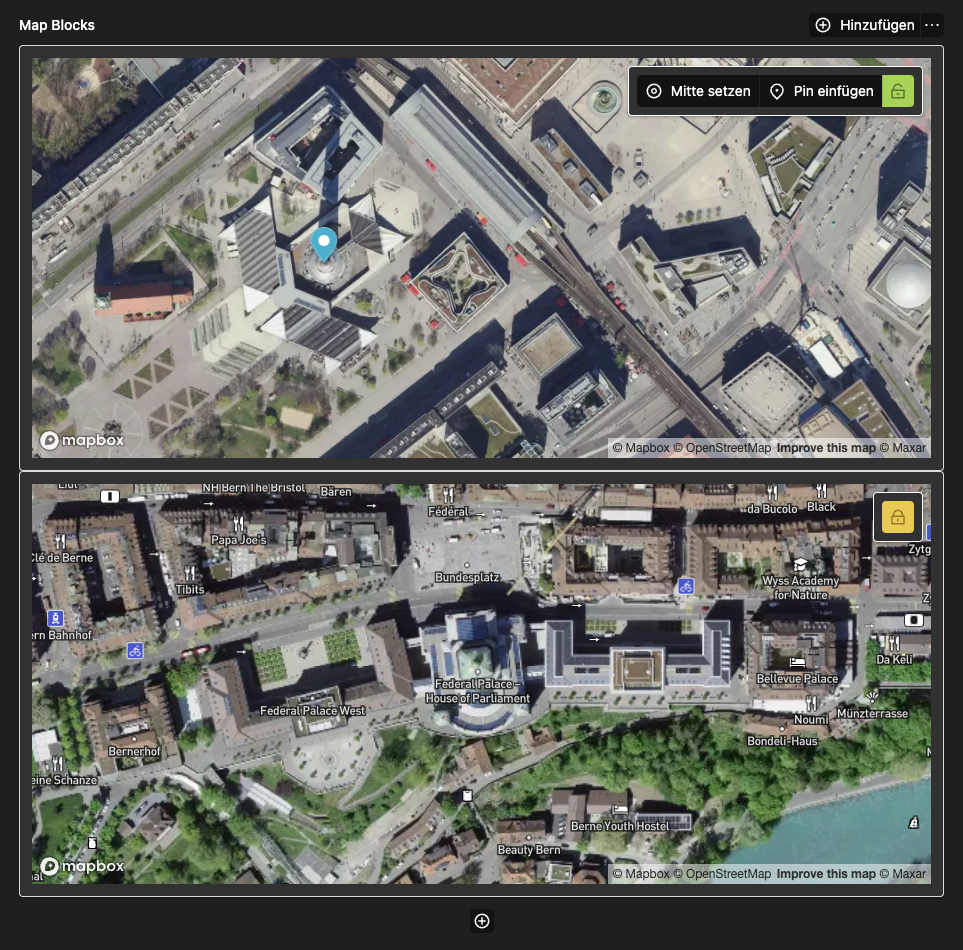
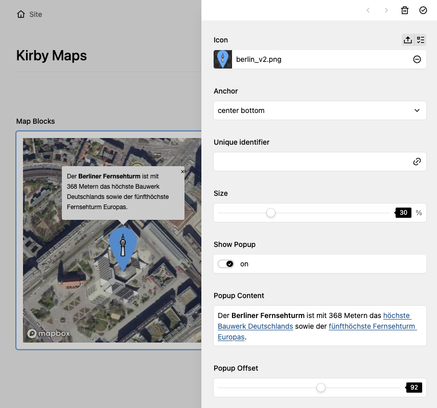

# Kirby Map

## Overview

**2-in-1-Plugin**: All you need to set up a map on your website. This plugin includes two rich feature sets:

- 🔎 **Geolocation field:**
  - Search for your location and get results (name, lat, long) into fields

- 🗺 **Map block:**
  - Built-in Mapbox instance
  - Set the following values for…
    - design
    - (center) location
    - zoom
  - Insert unlimited numbers of 📍 markers
    - location
    - icon
    - anchor of the icon (`top left`, `center center`, `bottom right`, etc.)
    - size of the Icon (100% = original size)
    - popup: text and horizontal offset to the location


> This plugin is free to use and published under the MIT license. If you use this plugin for commercial purposes, or you want to show your appreciation. [support me with a donation](https://www.paypal.com/donate/?hosted_button_id=LBCLZVHS4K2R6).

## Installation

**Manually**

[Download](https://github.com/youngcut/kirby-map) and copy the plugin into your plugin folder: `/site/plugins/`

**With Composer**

`composer require microman/kirby-map`

## Configuration

Kirby Map uses [Mapbox](https://www.mapbox.com/) for geolocation and map view. For internal purposes, a default token is already set. You probably want to replace that for your specific use-case.

To use Mapbox on your website, create your very own [access token](https://docs.mapbox.com/help/getting-started/access-tokens) and set it in your config file: `/site/config/config.php`

```php
return [
  'microman.map.token' => 'YOUR-TOKEN'
];
```

## Geolocation field



Here's an example how to use the geolocationg field in your blueprint:

```yaml
myGeoLocation:
  label: My Geolocation
  type: geolocation
  default:
    name: "Berlin"
    lat: 13.38333
    lng: 52.51667
```

### How to use the geolocation field in your template

```php
<?php $mylocation = $page->myGeoLocation()->toLocation() ?>

Name: <?= $mylocation->name() ?>
Latitude: <?= $mylocation->lat() ?>
Longitude: <?= $mylocation->lng() ?>
```

## Map block



With the Map block, you can set up your map with a live preview. To add this block to your blueprint, simply add a `blocks` field:

```yaml
myContent:
  type: blocks
  fieldsets:
    - maps
```

To customize the default block blueprints, copy the two files located in `/site/plugins/kirby-map/blueprints/blocks/` to your blocks blueprint folder: `/site/blueprints/blocks`

### Markers

You can add as many markers as you want right from within your map block. Try to place your marker in the visible preview.



### How to use the map block in your template

The map will be rendered inside your block field.

By default, the Block outputs an open source Mapbox instance.

If you want to use the [Google Maps JavaScript API](https://developers.google.com/maps/documentation/javascript/overview) copy and rename `/site/plugins/kirby-map/lib/examples/google-maps.php` to `site/snippets/blocks/maps.php`

> Don't forget to replace `[YOUR-API]` with your [Google-API](https://developers.google.com/maps/documentation/javascript/get-api-key) in the last line.

## Credits

Powered by [Mapbox](https://www.mapbox.com/). Inspired by [Sylvain's Kirby-Locator](https://github.com/sylvainjule/kirby-locator)

## License

MIT

> Do you like this Plugin? [Buy me a ☕️](https://www.paypal.com/donate/?hosted_button_id=LBCLZVHS4K2R6)